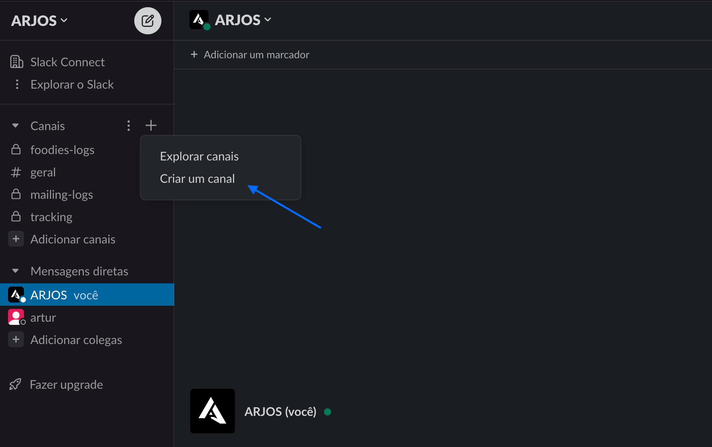

[comment]: <> (

)

# 📬 Visits Monitor - Laravel + Slack Integration
### Receive notifications when you receive visits on _GitHub_!

Já pensou em ser avisado sempre que alguém acessar o seu GitHub? Com essa aplicação OpenSource você recebe notificações via Slack sempre que tiver um novo visitante!

Basta possuir uma conta no Slack e seguir os passos à seguir.

## Live Project
Para instalar o Monitor de Visitas ao seu perfil do GitHub, basta colar o código que geramos na nossa página. Veja abaixo como utilizar.

### Criando um novo canal no Slack

Primeiro, você precisa ter um canal que receberá as notificações via webhook. Para isso, basta clicar no ícone + e selecionar a opção "Criar um canal".

## Learning Laravel

Laravel has the most extensive and thorough [documentation](https://laravel.com/docs) and video tutorial library of all modern web application frameworks, making it a breeze to get started with the framework.

If you don't feel like reading, [Laracasts](https://laracasts.com) can help. Laracasts contains over 1500 video tutorials on a range of topics including Laravel, modern PHP, unit testing, and JavaScript. Boost your skills by digging into our comprehensive video library.

## Contributing

Thank you for considering contributing to the Laravel framework! The contribution guide can be found in the [Laravel documentation](https://laravel.com/docs/contributions).

## Code of Conduct

In order to ensure that the Laravel community is welcoming to all, please review and abide by the [Code of Conduct](https://laravel.com/docs/contributions#code-of-conduct).

## Security Vulnerabilities

If you discover a security vulnerability within Laravel, please send an e-mail to Taylor Otwell via [taylor@laravel.com](mailto:taylor@laravel.com). All security vulnerabilities will be promptly addressed.

## License

The Laravel framework is open-sourced software licensed under the [MIT license](https://opensource.org/licenses/MIT).
